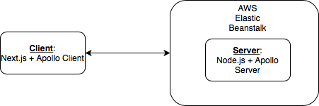

I recently was given a task to add user authentication to our website. It was decided to implement the authentication logic using [httpOnly](https://developer.mozilla.org/en-US/docs/Web/HTTP/Cookies) cookie. Client-side the browser will take care of passing the cookie of course so the only thing left was to pass the cookie header server-side. Headers can be passed to Apollo client in the [constructor](https://github.com/apollographql/apollo-client/blob/master/src/ApolloClient.ts#L40). The diagram below displays our technology stack:



`next-with-apollo` is a handy npm [package](https://www.npmjs.com/package/next-with-apollo) which makes headers available from [Express.js](https://expressjs.com) (which serves server-side pages), thus:

```jsx
import withApollo from "next-with-apollo"
import ApolloClient, { InMemoryCache } from "apollo-boost"
import renderFn from "./render"

export default withApollo(
  ({ initialState, headers }) => {
    return new ApolloClient({
      uri: "https://example.com/graphql",
      cache: new InMemoryCache().restore(initialState || {}),
      headers, // <- headers are passed here
    })
  },
  {
    render: renderFn,
  }
)
```

After I implemented the logic I was quite happy and went for a break to practice my [Yo-Yo](https://www.youtube.com/watch?v=-wiNh4LLQzg) skills (Yo-Yo-ing has become trendy in our office).

I returned to my work station in order to finish the task: polish the server logic which handles authentication. Eventually I was done.

> Everything worked perfectly in the development environment.

I had another Yo-Yo practice. The only thing left was to deploy the logic to our staging environment. When I checked the website after deployment there was an error:

> ApolloError: Network error: request to https://example.com/graphql/ failed, reason: write EPROTO 140152723232576:error:14094410:SSL routines:ssl3_read_bytes:sslv3 alert handshake failure:../deps/openssl/openssl/ssl/record/rec_layer_s3.c:1544:SSL alert number 40

Since I added a lot of logic in the task including [CORS](https://developer.mozilla.org/en-US/docs/Web/HTTP/CORS), cookies and a bunch of graphql resolvers I had to minimize the number of possible causes of bugs.

At first I suspected that CORS is culprit, that somehow it blocks browser requests. This was not the case however. After removing authentication logic piece by piece in order to identify the problem I discovered the issue was passing headers to the Apollo client as can be seen in the code excerpt above, specifically the `host` header which was something like `bla.bla.bla.elasticbeanstalk.com`.

"But what does that have to do with the SSL handshake error?", you ask. Well, it turns out that `host` header is quite important and it may be used in Server Name Indication ([SNI](https://en.wikipedia.org/wiki/Server_Name_Indication)) extension to TLS protocol. Here's the gist:

> Serving multiple domains (virtual hosts) per a given IP address is called [name-based virtual hosting](https://en.wikipedia.org/wiki/Virtual_hosting#Name-based). In name-based hosting you tell the server the virtual host you're interested in via the host header. Such approach wouldn't work out of the box because headers are not sent to the server before SSL handshake has occurred. But in order for the SSL handshake to occur the server must somehow know for which domain to serve the SSL certificate. In order to solve the chicken-and-egg conundrum SNI was invented: at the beginning of SSL handshake you tell the server which domain you're interested in, usually via the `servername` option. Thus SNI allows to use SSL with name-based virtual hosting which is significantly [cheaper](https://aws.amazon.com/cloudfront/custom-ssl-domains/) than having a dedicated IP address per domain. Different clients implement SNI differently, specifically Apollo Client [uses](https://github.com/apollographql/apollo-client/blob/master/src/link/http/checkFetcher.ts) fetch API-based utility `node-fetch` which in [its turn](https://github.com/node-fetch/node-fetch/blob/cd33d2237889e13847b9b5168075753b66a16449/src/index.js#L60) uses Node.js `https` module. If the host header is set to some value then `https` module [assigns](https://github.com/nodejs/node/blob/6bcea0a38365f518580a4dbbf2f5627bede5aac5/lib/_http_agent.js#L275) the value to `servername`, otherwise the hostname is assigned to `servername`.

So because our AWS setup was configured to use SNI for the website and I was explicitly passing the host header `bla.bla.bla.elasticbeanstalk.com`, the `servername` was set to it and as a result SNI failed because our SSL certificate was rather for `example.com`.

In order to fix the bug I [found out](https://github.com/lfades/next-with-apollo/issues/88#issuecomment-570010727) that you can simply pass only the header you need in Apollo client constructor, so I only passed the cookie header:

```jsx
import withApollo from "next-with-apollo"
import ApolloClient, { InMemoryCache } from "apollo-boost"
import renderFn from "./render"

export default withApollo(
  ({ initialState, headers }) => {
    return new ApolloClient({
      uri: "https://example.com/graphql",
      cache: new InMemoryCache().restore(initialState || {}),
      headers: {
        cookie: headers?.cookie,
      },
    })
  },
  {
    render: renderFn,
  }
)
```

In case you're wondering how the question mark in this line `cookie: headers?.cookie` is valid Javascript check out the [optional chaining](https://www.npmjs.com/package/babel-plugin-transform-optional-chaining) Babel.js plugin, it's awesome!
