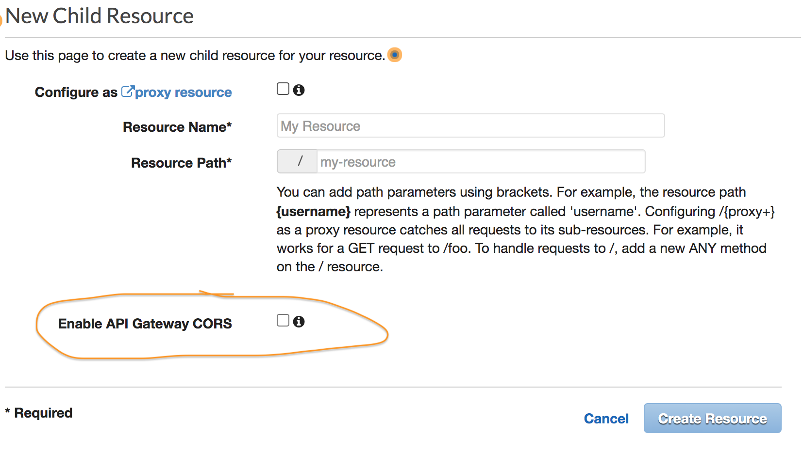
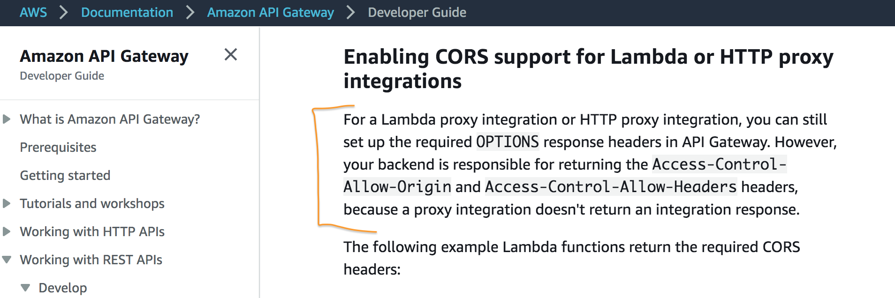
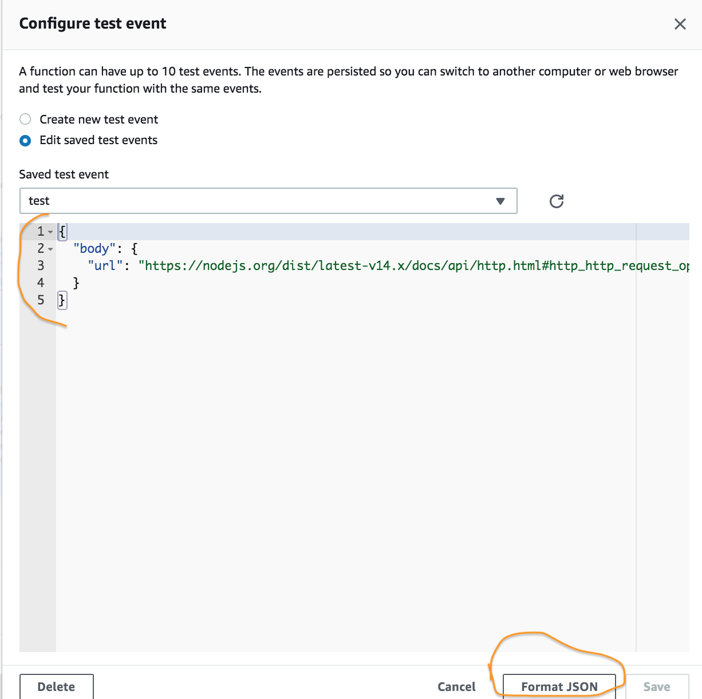

### Table of Contents:

1. [CORS issue.](#cors)
2. [Test event quirk.](#test-event)

<a name="cors" style="color: black;box-shadow: none;">I</a> recently had a project where I had a website which used a REST API comprised of just one endpoint, which performed a very simple task. This is a great use case for a serverless function, like [AWS Lambda](https://aws.amazon.com/lambda).

In order to expose an AWS Lambda function to the "outer world" another AWS service can be used: [API Gateway](https://aws.amazon.com/api-gateway). A great tutorial from AWS explains how to set up [AWS Lambda](https://webapp.serverlessworkshops.io/serverlessbackend/) and [API Gateway](https://webapp.serverlessworkshops.io/restfulapis/restapi/) services.

Since my website and the REST API used different domains and [non-simple requests](https://developer.mozilla.org/en-US/docs/Web/HTTP/CORS#simple_requests) I had to whitelist the website domain in the backend service in order to comply with CORS. API Gateway passes incoming requests to AWS Lambda so I thought all I need to do is enable CORS in API Gateway which is quite easy because during API Gateway resource setup you can check `Enable CORS` checkbox:



However, when the website made a request to the API Gateway invoke URL the browser notified of CORS error, specifically that the `Access-Control-Allow-Origin` header was missing:

<span style="background-color: pink;">Access to fetch at 'myApiUrl.com' from origin 'myWebsiteUrl.com' has been blocked by CORS policy: No 'Access-Control-Allow-Origin' header is present on the requested resource.</span>

It turns out that in API Gateway integration with AWS Lambda, the latter is [responsible](https://docs.aws.amazon.com/apigateway/latest/developerguide/how-to-cors.html) for returning the headers required by CORS



Below is an example from [AWS docs](https://docs.aws.amazon.com/apigateway/latest/developerguide/how-to-cors.html) on how to add the necessary CORS headers to your handler response:

```js
exports.handler = async event => {
  const response = {
    statusCode: 200,
    headers: {
      "Access-Control-Allow-Headers": "Content-Type",
      "Access-Control-Allow-Origin": "https://www.example.com",
      "Access-Control-Allow-Methods": "OPTIONS,POST,GET",
    },
    body: JSON.stringify("Hello from Lambda!"),
  }
  return response
}
```

Once I added the above headers the CORS issue was resolved.

<a name="test-event" style="color: black;box-shadow: none;">Another</a> quirk I came across was inconsistency between the type of request body and test event (using Node.js environment):

```js
exports.handler = async event => {
  let url
  if (typeof event.body === "string") {
    // handle real requests
    url = JSON.parse(event.body).url
  } else {
    // handle test events
    url = event.body.url
  }

  const response = {
    statusCode: 200,
  }

  return response
}
```

When the handler receives a real request with a JSON body, the body is a string which needs to be parsed as an object first in order to access its fields (`url` in the code above). When configuring a test event as follows:



I expected that the test event would also be a string, because the input must be JSON however, it is actually parsed automatically before arriving to the handler. This means a condition is required (as in the code above) to distinguish between real requests and test events.

Apart from the above issues I had a great experience with AWS Lambda. The fact the you can create a REST API so quickly without having to maintain any server environment is amazing!
